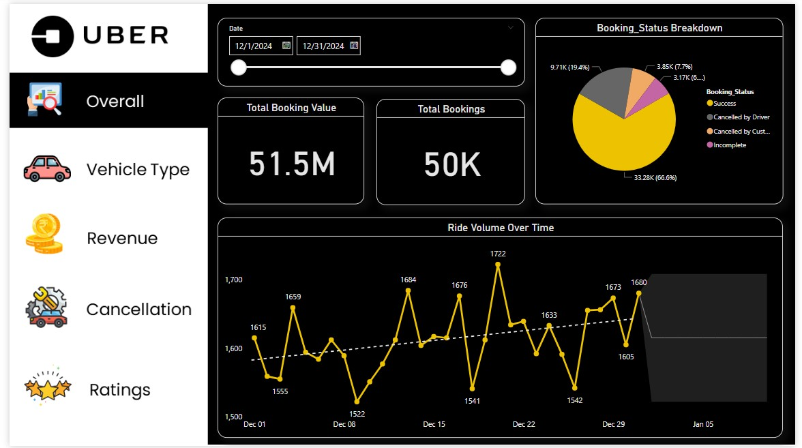

# Uber-Booking-Analysis-Project
Full Dashboard - [See Full Dashboard](https://app.powerbi.com/view?r=eyJrIjoiN2Q1YTMyMTYtNDQ2Yy00NDlmLWExZjctYjhkNWZhZTI1NDJjIiwidCI6ImRmODY3OWNkLWE4MGUtNDVkOC05OWFjLWM4M2VkN2ZmOTVhMCJ9)

The objective of this project is to analyze Uber booking data for Pune in December to uncover booking trends, cancellations, and high-demand areas. 
It assesses driver performance, customer behavior, and revenue patterns while identifying inefficiencies. Insights will guide strategies to improve service quality, 
optimize operations, and enhance customer satisfaction.

Key Goals :
Understand Booking Trends:

1. Identify daily, weekly, and peak-hour trends in bookings during December.

2. Analyze Cancellations:
a. Evaluate the volume of cancellations by customers and drivers.
b. Explore reasons for cancellations and assess the impact on overall operations.

3. Geographical Insights:
a. Determine the most and least popular pickup and drop-off locations in Pune.
b. Identify high-demand zones and areas requiring better service coverage.

4. Driver Performance Analysis:
a. Assess the performance of drivers in terms of trip completions and cancellations.
b. Explore driver behavior and its correlation with customer satisfaction.

5. Customer Behavior Analysis:
a. Investigate booking patterns based on customer demographics, if available.
b. Identify customer preferences, such as trip lengths, time of day, or ride type.

6. Revenue Insights:
a. Calculate the total revenue generated during December.
b. Analyze fare trends to understand the impact of peak pricing or discounts.

7. Operational Efficiency:
a. Evaluate average wait times and trip durations.
b. Highlight inefficiencies in ride assignments or cancellations and suggest improvements.
